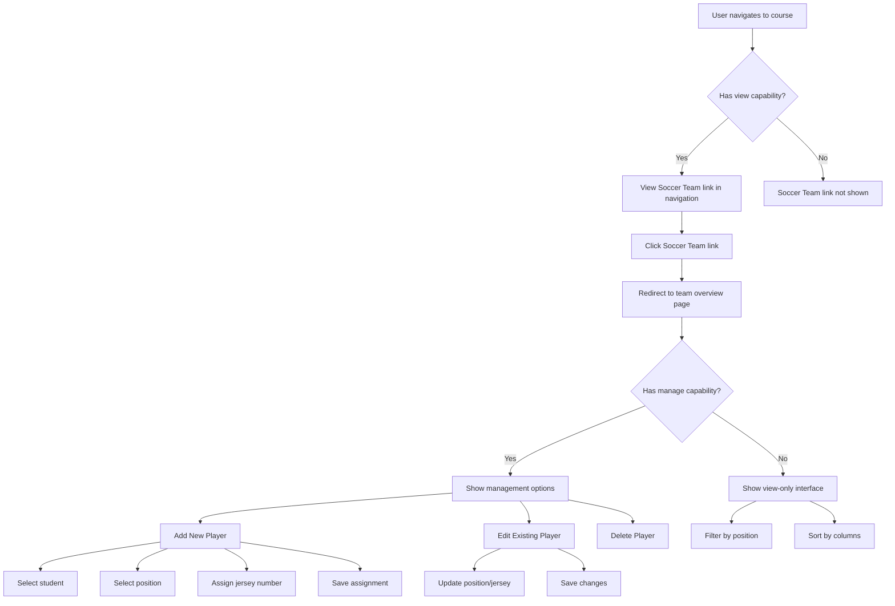

[](https://github.com/khairu-aqsara/moodle-local_soccerteam/actions/workflows/main.yml)
# Moodle Soccer Team Plugin

A local Moodle plugin that allows course instructors to manage soccer team assignments within courses. This plugin provides functionality to assign students to soccer team positions with unique jersey numbers and view team rosters.

## Features

- Assign students to specific playing positions (goalkeeper, defender, midfielder, forward)
- Assign unique jersey numbers to team players
- Filter and sort the team roster by various criteria
- Restrict team management to users with appropriate capabilities
- REST API endpoints for retrieving team data
- Mobile-responsive UI for both team management and viewing

## Requirements

- Moodle 4.1 or newer
- PHP 7.4 or newer

## Installation

1. Download the plugin code
2. Extract the code to `/local/soccerteam` in your Moodle installation directory
3. Log in to Moodle as an administrator
4. Navigate to Site Administration > Notifications
5. Follow the on-screen instructions to install the plugin
6. After installation, set up necessary permissions for your roles (see "Permissions" section)

Alternatively, you can install the plugin using git:

```bash
cd /path/to/your/moodle/local
git clone https://github.com/username/moodle-local_soccerteam.git soccerteam
```

Then follow steps 3-6 above.

## Permissions

The plugin defines two capabilities:

- `local/soccerteam:view`: Allows users to view the team roster
- `local/soccerteam:manage`: Allows users to manage team assignments (add, edit, delete players)

To set these permissions:

1. Go to Site Administration > Users > Permissions > Define roles
2. Edit the roles you want to grant permissions to (e.g., Teacher, Manager)
3. Search for "Soccer Team" capabilities and enable as needed

## Usage

### For instructors (with manage capability)

1. Navigate to a course
2. In the course navigation, click on "Soccer Team"
3. View the current team roster
4. Use the "Add New Player" button to add students to the team
5. Assign a position and jersey number to each player
6. Use the edit and delete icons to modify or remove player assignments

### For students and other users (with view capability)

1. Navigate to a course
2. In the course navigation, click on "Soccer Team"
3. View the team roster
4. Use the filters to view players by position
5. Use the column headers to sort the roster by different criteria

## Web Services

The plugin provides REST API endpoints for integration with external systems, allowing programmatic access to the soccer team data. This can be useful for building custom reports, mobile applications, or integrating with other systems.

### Available Endpoints

1. **Get Team By Course**
   - Function name: `local_soccerteam_get_team_by_course`
   - Description: Returns all team members for a specific course
   - Parameters:
     - `courseid` (int): The ID of the course
   - Returns: Array of team member objects, each containing:
     - `userid` (int): User ID of team member
     - `fullname` (string): Full name of the player
     - `position` (string): Playing position (goalkeeper, defender, midfielder, forward)
     - `jerseynumber` (int): Assigned jersey number

2. **Get Player Details**
   - Function name: `local_soccerteam_get_player_details`
   - Description: Returns detailed information about a specific player in a course
   - Parameters:
     - `courseid` (int): The ID of the course
     - `userid` (int): The ID of the user/player
   - Returns: Player object containing:
     - `userid` (int): User ID of the player
     - `fullname` (string): Full name of the player
     - `position` (string): Playing position
     - `jerseynumber` (int): Assigned jersey number
     - Additional user profile data as available

### Setting Up Web Service Access

To use these endpoints, you need to:

1. **Enable Web Services**:
   - Navigate to Site Administration > Plugins > Web Services > Overview
   - Follow the setup steps to enable web services
   - Enable the REST protocol

2. **Create a Service User**:
   - Create a dedicated user for API access
   - Assign appropriate system permissions and the `local/soccerteam:view` capability

3. **Create a Token**:
   - Navigate to Site Administration > Plugins > Web Services > Manage tokens
   - Create a new token for your service user
   - Select the "Soccer Team API" service
   - Save the generated token securely

### Usage Examples

#### REST API Example (using cURL)

```bash
# Get team for a course (replace TOKEN and COURSEID with actual values)
curl -X POST \
  https://your-moodle-site.com/webservice/rest/server.php \
  -d "wstoken=TOKEN&wsfunction=local_soccerteam_get_team_by_course&moodlewsrestformat=json&courseid=COURSEID"

# Get player details (replace TOKEN, COURSEID, and USERID with actual values)
curl -X POST \
  https://your-moodle-site.com/webservice/rest/server.php \
  -d "wstoken=TOKEN&wsfunction=local_soccerteam_get_player_details&moodlewsrestformat=json&courseid=COURSEID&userid=USERID"
```
### Security Considerations

- Never expose your token in client-side code that will be accessible to users
- Consider implementing additional authentication for sensitive operations
- Create tokens with the minimum required permissions
- Regularly rotate tokens for improved security
- Monitor web service usage through Moodle's logging system

## Testing

The plugin includes PHPUnit tests covering the core functionality. To run the tests:

1. Set up your Moodle development environment for phpunit and install the moodle-plugin-ci
2. Run the following command from your Moodle local plugin directory:

```bash
moodle-plugin-ci phpunit --verbose --testdox --moodle=<your moodle root path> .
```

Alternatively, you can run phpcs and phpcbf to check the files:

```bash
moodle-plugin-ci phpcs --standard=moodle .
moodle-plugin-ci phpcbf --standard=moodle .
```

## Flow Diagram



## Known Limitations and Potential Issues

The Soccer Team plugin has been thoroughly tested but has the following known limitations or potential issues:

### Limitations

1. **Team Size Restriction**: 
   - The plugin currently supports jersey numbers from 1 to 25, limiting team size to 25 players.
   - There is no automatic handling for teams requiring larger rosters.

2. **Position Restrictions**:
   - Only four standard soccer positions are supported (goalkeeper, defender, midfielder, forward).
   - More specialized positions (e.g., sweeper, winger, striker) are not currently available.
   - No support for custom position definitions.

3. **Single Team Per Course**:
   - Each course can only have one team.
   - No support for multiple teams or team divisions within a course.

4. **No Automated Role Assignment**:
   - Being assigned to the team does not automatically enroll students in the course.
   - Team assignments do not automatically update when students are unenrolled from a course.

### Potential Issues

1. **Large Course Performance**:
   - The student selector dropdown may become unwieldy in courses with many students.
   - Consider using the search feature for large courses.

2. **Web Services Timeout**:
   - API calls for courses with large teams might experience timeouts with default server configurations.
   - Consider increasing server timeout limits if experiencing issues.

3. **Mobile Responsiveness Edge Cases**:
   - Some management actions might be challenging on very small mobile screens.
   - The table may require horizontal scrolling on narrow viewports.

4. **Database Constraints**:
   - The plugin enforces unique jersey numbers through application logic rather than database constraints.
   - In rare cases of concurrent access, duplicate jersey numbers might occur.

5. **Compatibility Notes**:
   - While designed for Moodle 4.1+, some advanced styling relies on Bootstrap 4 components.
   - Themes that significantly override Moodle's default Bootstrap styling might require adjustments.

## Customizing

You can customize the plugin appearance by modifying the following files:
- `styles.css`: CSS styles for the plugin
- `templates/team_overview.mustache`: Template for the team overview page

## Troubleshooting

Common issues:
- If the Soccer Team link doesn't appear in the course navigation, check that the user has the appropriate view capability.
- If a user can't add or edit team members, confirm they have the manage capability.
- If jersey number validation fails, ensure the number is between 1 and 25 and isn't already assigned to another player in the course.

## Contributing

Contributions are welcome! Please follow the Moodle coding standards and submit pull requests for review.

## License

This plugin is licensed under the [GNU GPL v3 or later](http://www.gnu.org/copyleft/gpl.html).

## Credits

Developed by Khairu Aqsara <wenkhairu@gmail.com>
